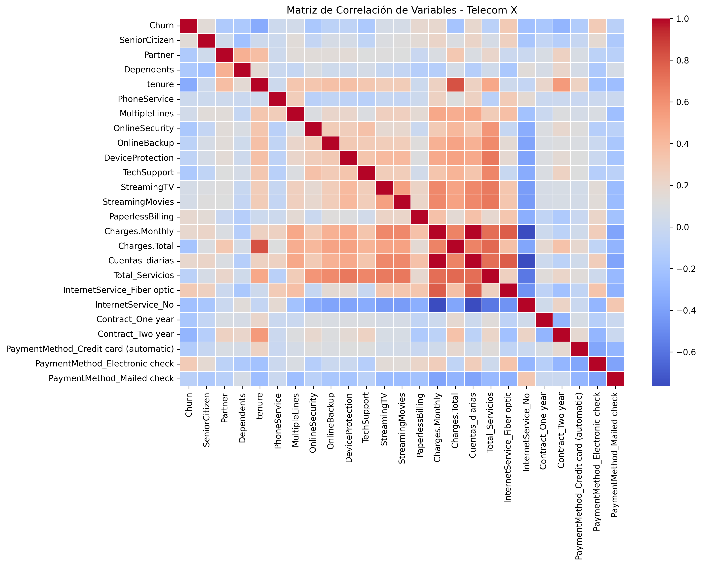
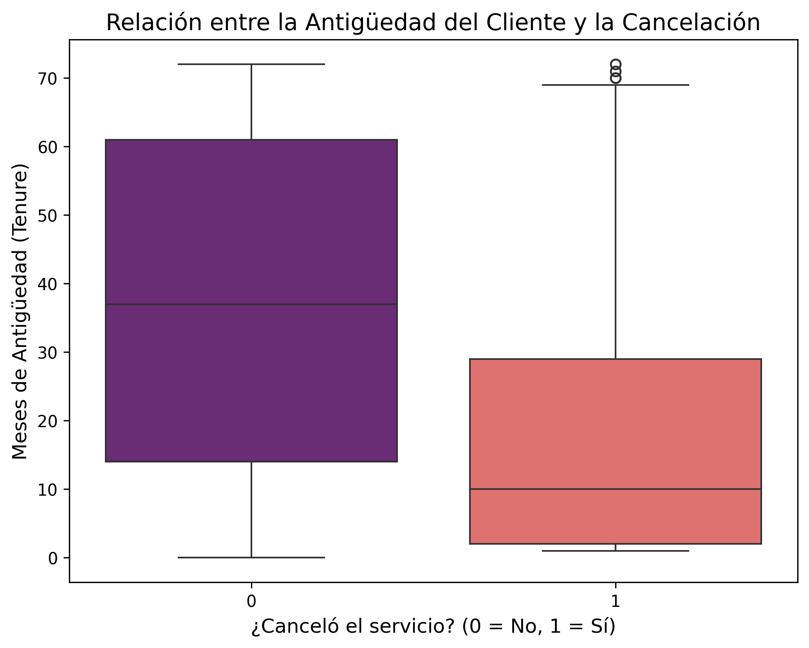
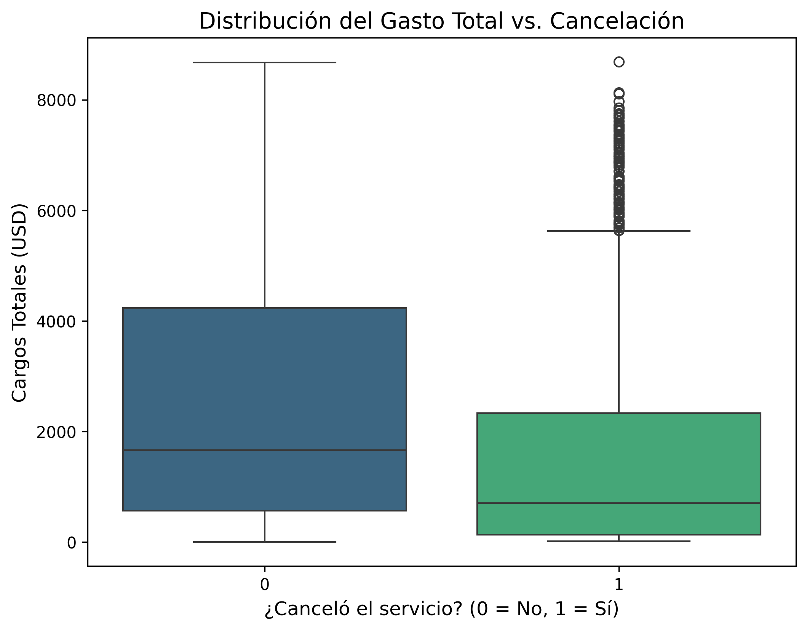
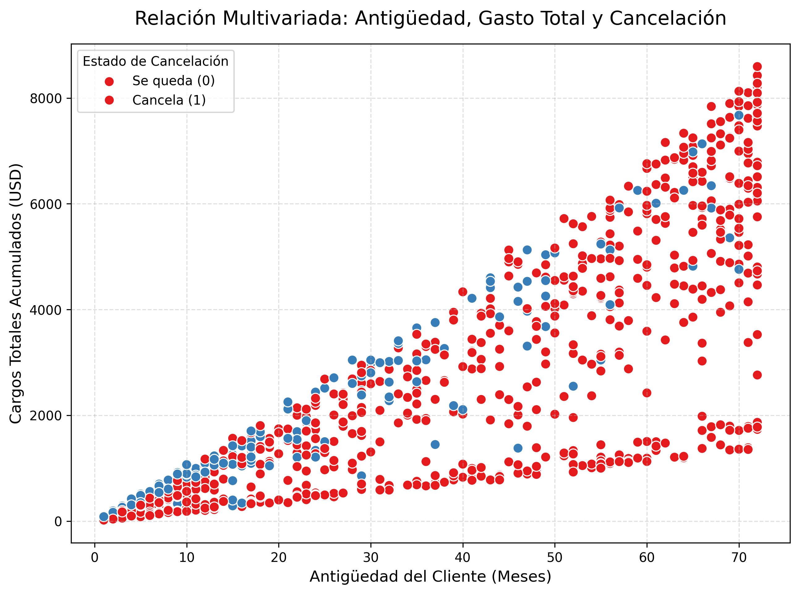
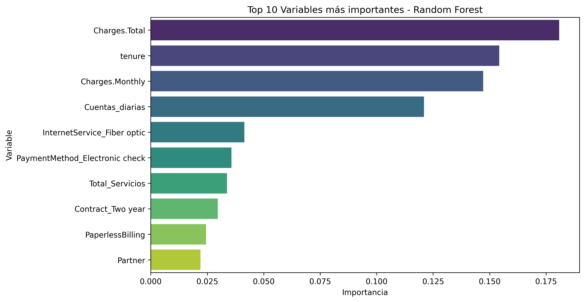

# **Telecom X – Parte 2: Predicción de Cancelación (Churn)**

En cumplimiento con el objetivo de anticipar la cancelación de clientes, se ha desarrollado un pipeline robusto de Machine Learning. Este sistema permite a Telecom X transitar de un análisis reactivo a uno proactivo, identificando patrones de fuga antes de que el cliente finalice su contrato.

---

## **Tecnologías Utilizadas**
* **Python**
* **Pandas / Numpy** (Manipulación de datos)
* **Scikit-Learn** (Modelado y Preprocesamiento)
* **Seaborn / Matplotlib** (Visualización avanzada)

---

## **Objetivo del Proyecto**
Desarrollar, evaluar e interpretar modelos predictivos para reducir la tasa de cancelación (*Churn*), permitiendo a la empresa tomar decisiones proactivas y diseñar estrategias de retención personalizadas.

---

## **Fases del Proyecto**

### **1. Extracción y Preparación de los Datos**
Se realizó una limpieza profunda y transformación de los datos originales:
* **Tratamiento de nulos y duplicados.**
* **Codificación:** Transformación de variables categóricas a numéricas.
* **Escalado:** Uso de `StandardScaler` para normalizar las magnitudes de cargos financieros y antigüedad.

### **2. Correlación y Selección de Variables**
Se identificaron los factores que tienen mayor relación directa con la fuga de clientes. La matriz de correlación npermitió entender cómo interactúan las variables entre sí.

### **3. Análisis Exploratorio Avanzado**
Para entender el comportamiento de los clientes que cancelan frente a los que permanecen, se analizó la distribución de la antigüedad y los cargos:

#### **A. Antigüedad y Gasto Total**
Los siguientes gráficos muestran que los clientes con menor permanencia y cargos totales más bajos son los más propensos al abandono.

| Distribución de Antigüedad | Distribución de Gastos Totales |
| :---: | :---: |
|  |  |

#### **B. Relación Multivariada**
En este gráfico de dispersión se observa la "zona de riesgo": clientes con pocos meses de antigüedad y cargos acumulados bajos concentran la mayor cantidad de cancelaciones (puntos rojos).

---

## **Modelado Predictivo**
Se entrenaron y compararon dos arquitecturas para encontrar el equilibrio entre precisión y generalización:

| Métrica | Regresión Logística (Ganador) | Random Forest |
| :--- | :---: | :---: |
| **Exactitud (Test)** | **80.19%** | 78.82% |
| **Recall (Sensibilidad)** | **53.74%** | 49.73% |
| **F1-Score** | **58.26%** | 54.71% |

**Conclusión técnica:** Se eligió la **Regresión Logística** por su estabilidad y nulo sobreajuste (Overfitting), a diferencia del Random Forest que mostró un rendimiento dispar entre entrenamiento (99%) y prueba (78%).

### **Importancia de las Variables**
El modelo de Random Forest permite visualizar qué factores pesan más en la decisión del cliente:

---

## **Insights Estratégicos**
1. **Ventana Crítica:** Los primeros 12 meses de antigüedad son el periodo de mayor riesgo de fuga.
2. **Método de Pago:** El uso de *Electronic Check* está vinculado a una mayor cancelación; incentivar pagos automáticos podría mejorar la retención.
3. **Servicio Técnico:** La variable *InternetService_Fiber optic* aparece como un factor relevante de Churn, lo que sugiere revisar la calidad o costo de este servicio.

